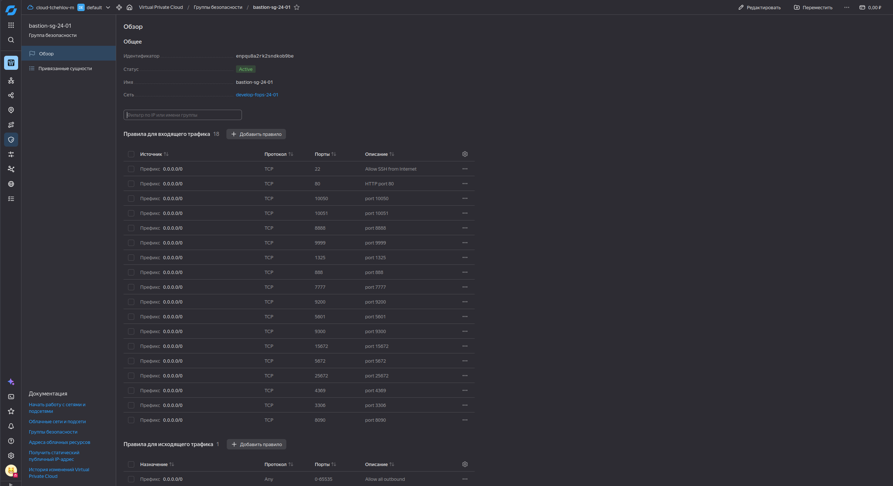
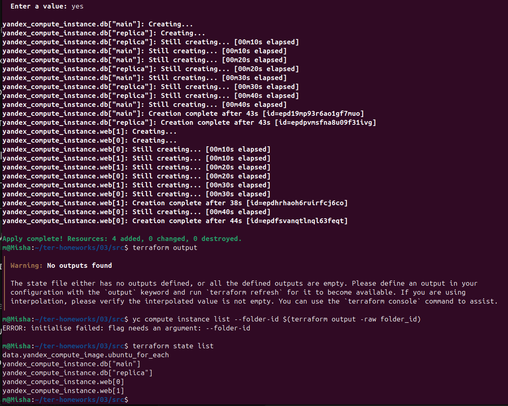
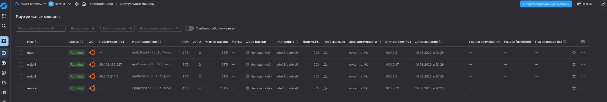
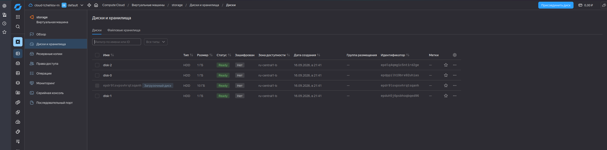

# Лабораторная работа: Управляющие конструкции в Terraform (Yandex Cloud)

**Цель работы:** отработать основные принципы и методы работы с управляющими конструкциями Terraform (`count`, `for_each`, `dynamic`), освоить работу с шаблонизатором Terraform (`templatefile`) и автоматическую генерацию Ansible-инвентаря.

**Версия Terraform:** `~> 1.12.0`  
**Провайдер:** `yandex-cloud/yandex` (версия `>= 0.80.0`), `hashicorp/local` (версия `>= 2.0.0`)

---

## Чек-лист готовности

- [x] Аккаунт Yandex Cloud зарегистрирован, использован промокод на грант.
- [x] Установлен Yandex CLI.
- [x] Исходный код доступен в директории `03/src`.
- [x] Все ВМ созданы как прерываемые (`preemptible = true`) для экономии средств.
- [x] Хардкод значений отсутствует: все параметры вынесены в переменные и локальные значения.

---

## Задание 1. Изучение проекта, исправление ошибок, запуск

### Скриншот входящих правил «Группы безопасности» в ЛК Yandex Cloud



### Исправление синтаксических ошибок

В исходном коде были намеренно допущены две ошибки:

| № | Где | Суть ошибки | Исправление |
|---|-----|------------|------------|
| 1 | `platform_id = "standart-v4"` | Опечатка: `standart` вместо `standard`. Платформы `v4` не существует в Yandex Cloud. | `platform_id = "standard-v1"` |
| 2 | `cores = 1` (для `standard-v1`) | Для платформы `standard-v1` минимально допустимое количество ядер — 2. YC отклоняет запрос с ошибкой: *the specified number of cores is not available*. | `cores = 2` |

### Команды запуска

```bash
terraform init -upgrade
terraform validate
terraform plan
terraform apply
```

## Задание 2. Создание ВМ через count и for_each





# Развёрнутая инфраструктура (Yandex Cloud)

В рамках задания были созданы 4 виртуальные машины в зоне доступности `ru-central1-b`. Все ВМ являются **прерываемыми** (preemptible) с долей vCPU 20%, что снижает стоимость использования для учебных целей.

## Список ресурсов

| Имя ВМ | Статус | Публичный IPv4 | Внутренний IPv4 | RAM | vCPU | Размер диска | Платформа | Тип ВМ |
| :--- | :--- | :--- | :--- | :--- | :--- | :--- | :--- | :--- |
| `main` | Running | — | `10.0.2.5` | 2 ГБ | 2 | 5 ГБ | Intel Broadwell | Прерываемая (20% vCPU) |
| `web-1` | Running | `89.169.188.227` | `10.0.2.17` | 1 ГБ | 2 | 5 ГБ | Intel Broadwell | Прерываемая (20% vCPU) |
| `web-2` | Running | `46.243.211.6` | `10.0.2.8` | 1 ГБ | 2 | 5 ГБ | Intel Broadwell | Прерываемая (20% vCPU) |
| `replica` | Running | — | `10.0.2.32` | 4 ГБ | 4 | 10 ГБ | Intel Broadwell | Прерываемая (20% vCPU) |

## Соответствие ресурсам Terraform

| Логическое имя (Terraform) | Имя ВМ в Yandex Cloud | Назначение |
| :--- | :--- | :--- |
| `yandex_compute_instance.db["main"]` | `main` | Основная база данных |
| `yandex_compute_instance.db["replica"]` | `replica` | Реплика базы данных |
| `yandex_compute_instance.web` | `web-1` | Веб‑сервер №1 |
| `yandex_compute_instance.web` | `web-2` | Веб‑сервер №2 |

## Идентификаторы ресурсов (для проверки)

Для подтверждения, что инфраструктура создана именно через Terraform, ниже приведены ID экземпляров:

- `main`: `epd19mp93r6ao1gf7muo`
- `web-1`: `epdfsvanqtlnql63feqt`
- `web-2`: `epdhrhaoh6ruirfcj6co`
- `replica`: `epdpvmsfna8u09f31ivg`

## Задание 3: диски и ВМ storage



В рамках задания были созданы:
- 3 дополнительных диска по 1 ГБ (`disk-0`, `disk-1`, `disk-2`).
- Одна ВМ `storage` с подключением всех дисков через `dynamic secondary_disk`.

### Параметры ВМ

| Параметр | Значение |
| --- | --- |
| Имя | `storage` |
| Зона | `ru-central1-b` |
| vCPU | 2 |
| RAM | 2 ГБ |
| Тип дисков | `network-hdd` |
| Количество вторичных дисков | 3 |

