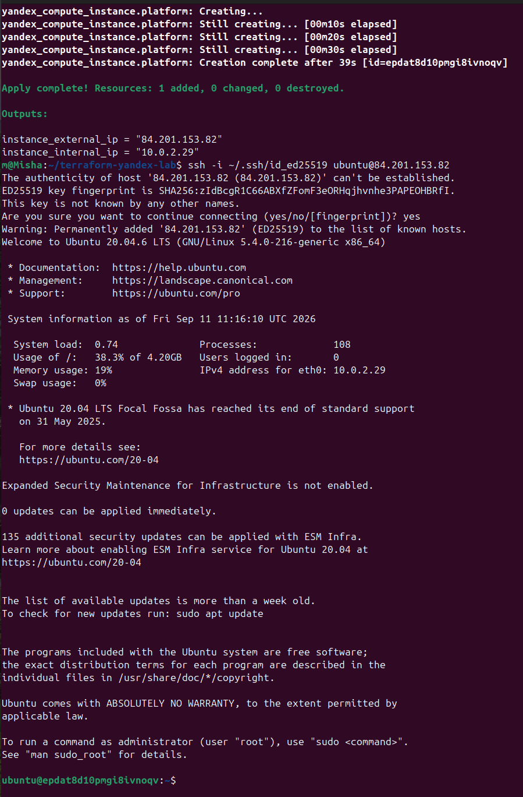
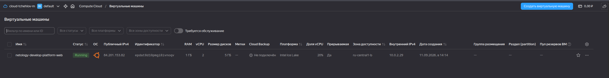
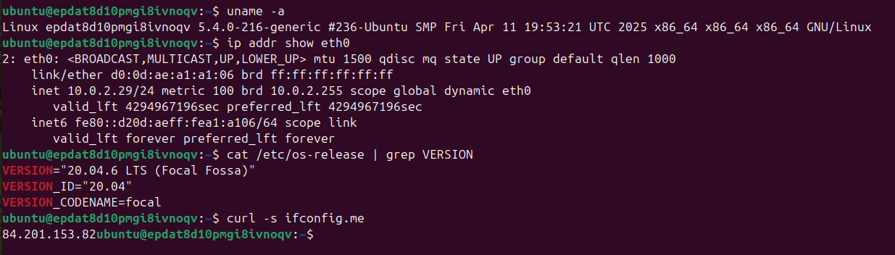
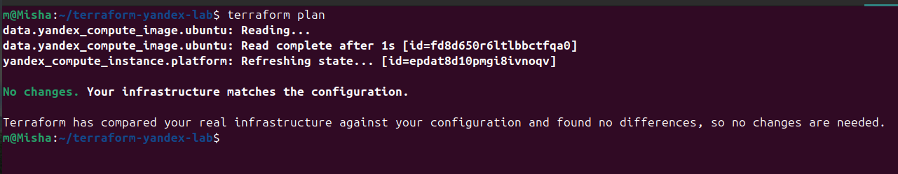

## Задание 1: Подтверждение внешнего IP-адреса

### Скриншот ВМ в консоли Yandex Cloud







*На скриншоте: ВМ `netology-develop-platform-web`, статус `RUNNING`, внешний IP `84.201.153.82`.*

### Исправление ошибок и запуск

### Намеренно допущенные ошибки и их исправление

| № | Где | В чём суть ошибки | Исправление |
|---|-----|-------------------|-------------|
| 1 | `platform_id = "standart-v4"` | Опечатка в слове `standart` (правильно — `standard`). Кроме того, платформы `v4` не существует в Yandex Cloud. Провайдер вернёт ошибку валидации или API-ошибку при создании ВМ. | `platform_id = "standard-v3"` |
| 2 | `cores = 1` (для платформы `standard-v3`) | Для платформы `standard-v3` минимальное количество ядер — 2. Yandex Cloud отклонит запрос с ошибкой вида: *the specified number of cores is not available*. | `cores = 2` |

Ошибки проявляются только на этапе terraform apply — terraform validate их не ловит, потому что синтаксис HCL корректен, а вот значения не проходят валидацию на стороне API Yandex Cloud.
Зачем в процессе обучения нужны preemptible = true и core_fraction = 5

preemptible = true — делает ВМ прерываемой. Yandex Cloud может остановить такую ВМ в любой момент (с уведомлением за 24 часа), но её стоимость примерно в 2–3 раза ниже, чем у обычной. Для учебных лабораторных это идеально: ты поднимаешь инфраструктуру на час-два, выполняешь задание, потом удаляешь. Риск того, что ВМ остановят посреди лабы, минимален для коротких сессий.

core_fraction = 5 — означает, что ВМ получает гарантированный доступ только к 5% процессорного ядра. Этого достаточно для учебных задач: запустить SSH, выполнить curl, поставить пакет, проверить сетевую связность. Производительность ниже, но и цена кратно меньше. Для лаб, где не нужно гонять нагрузки, это оптимальный баланс.

Итог: оба параметра позволяют существенно снизить стоимость обучения в облаке — иногда в 5–10 раз — без потери возможности выполнять все учебные задачи.


## Задание 2: Доступ к ВМ

- Публичный IP: `84.201.153.82`
- Внутренний IP: `10.0.2.29`
- Пользователь: `ubuntu`

Команда подключения:
```bash
ssh -i ~/.ssh/id_ed25519 ubuntu@84.201.153.82
```



## Проверка конфигурации (terraform plan)

После вынесения всех хардкод-значений в переменные с префиксом `vm_web_` и установки `default`, совпадающих с предыдущими значениями, `terraform plan` показывает отсутствие изменений:

```bash
data.yandex_compute_image.ubuntu: Reading...
data.yandex_compute_image.ubuntu: Read complete after 1s [id=fd8d650r6ltlbbctfqa0]
yandex_compute_instance.platform: Refreshing state... [id=epdat8d10pmgi8ivnoqv]

No changes. Your infrastructure matches the configuration.

Terraform has compared your real infrastructure against your configuration and found no differences, so no changes are needed.
```

## Задание 3: Создание второй ВМ (DB)

### Параметры созданных виртуальных машин

| Параметр | Web (`vm_web_`) | DB (`vm_db_`) | Комментарий |
|----------|------------------|---------------|-------------|
| Имя | `netology-develop-platform-web` | `netology-develop-platform-db` | Из переменных с префиксом |
| Cores | 2 | 2 | Одинаково |
| Memory | 1 ГБ | **2 ГБ** | У БД больше памяти (по заданию) |
| Core fraction | 20% | 20% | Одинаково |
| NAT | `true` | `false` | БД не видна из интернета — принцип наименьших привилегий |
| Preemptible | `true` | `true` | Обе прерываемые (дешевле, для лаб подходит) |
| Зона | `ru-central1-b` | `ru-central1-b` | Одна подсеть, единая зона доступности |
| Внешний IP | `158.160.31.142` | — | Назначен только веб‑ВМ |
| Внутренний IP | `10.0.2.15` | `10.0.2.11` | В одной подсети — возможна сетевая связность |


### Подтверждение выходных параметров Terraform

Вывод команды `terraform output`:

```bash
web_external_ip = "158.160.31.142"
web_internal_ip = "10.0.2.15"
```


## Задание 4: Единый output со сведениями о ВМ

Для получения сводной информации о виртуальных машинах создан единый output `vms_info`, который возвращает массив объектов с полями: `instance_name`, `external_ip`, `fqdn` для каждой ВМ.


### Вывод `terraform output vms_info`

```text
vms_info = [
  {
    "external_ip" = "158.160.31.142"
    "fqdn" = "..."
    "instance_name" = "netology-develop-platform-web"
  },
  {
    "external_ip" = null
    "fqdn" = "..."
    "instance_name" = "netology-develop-platform-db"
  },
]
```

Единый output со сведениями о ВМ

В рамках задания создан единый output `vms_info`, который возвращает массив объектов с информацией о каждой виртуальной машине: `instance_name`, `external_ip`, `fqdn`. Все значения берутся из атрибутов ресурсов Terraform — хардкод отсутствует.

### Конфигурация outputs.tf

```hcl
output "vms_info" {
  description = "Информация о ВМ: имя, внешний IP, FQDN"
  value = [
    {
      instance_name = yandex_compute_instance.web.name
      external_ip   = yandex_compute_instance.web.network_interface[0].nat_ip_address
      fqdn          = yandex_compute_instance.web.fqdn
    },
    {
      instance_name = yandex_compute_instance.db.name
      external_ip   = yandex_compute_instance.db.network_interface[0].nat_ip_address
      fqdn          = yandex_compute_instance.db.fqdn
    }
  ]
}

```

## Задание 5: Имена ВМ через locals с интерполяцией


В файле `locals.tf` создан единый блок `locals`, где имена виртуальных машин формируются через интерполяцию из нескольких входных переменных:

```hcl
locals {
  web_vm_name = "${var.vm_prefix}-develop-${var.vm_type_web}"
  db_vm_name  = "${var.vm_prefix}-develop-${var.vm_type_db}"
}
```


## Задание 5: Имена ВМ через locals и приведение конфигурации к корректному виду


### Цель задания

- Сформировать имена виртуальных машин в едином блоке `locals` через интерполяцию из нескольких переменных.
- Заменить прямые переменные в ресурсах на значения из `locals`.
- Применить изменения и убедиться, что инфраструктура остаётся стабильной.

### Реализация

В файле `locals.tf` создан блок `locals`, где имена ВМ собираются из отдельных смысловых частей:

```hcl
locals {
  web_vm_name = "${var.vm_project}-${var.vm_env}-${var.vm_platform}-${var.vm_role_web}"
  db_vm_name  = "${var.vm_project}-${var.vm_env}-${var.vm_platform}-${var.vm_role_db}"
```


## Задание 6: Структурированные map-переменные для ресурсов и metadata


### Цель задания

- Заменить отдельные переменные для CPU/RAM/дисков на единую `map(object)`-переменную `vms_resources`.
- Вынести общие метаданные в отдельную `map(string)`-переменную `metadata`.
- Закомментировать устаревшие переменные.
- Убедиться, что применение конфигурации не меняет инфраструктуру (`terraform plan` → `No changes`).

### Реализация

#### 1. Единая переменная `vms_resources`

В `vms_platform.tf` создана переменная типа `map(object)`, где параметры для каждой ВМ описаны вложенным объектом:

```hcl
variable "vms_resources" {
  type = map(object({
    cores         = number
    memory        = number
    core_fraction = number
    hdd_size      = number
    hdd_type      = string
    image_family  = string
    platform_id   = string
    preemptible    = bool
    nat            = bool
  }))
  default = {
    web = {
      cores         = 2
      memory        = 1
      core_fraction = 20
      hdd_size      = 5
      hdd_type      = "network-hdd"
      image_family  = "ubuntu-2004-lts"
      platform_id   = "standard-v3"
      preemptible    = true
      nat            = true
    }
    db = {
      cores         = 2
      memory        = 2
      core_fraction = 20
      hdd_size      = 5
      hdd_type      = "network-hdd"
      image_family  = "ubuntu-2004-lts"
      platform_id   = "standard-v3"
      preemptible    = true
      nat            = false
    }
  }
}

